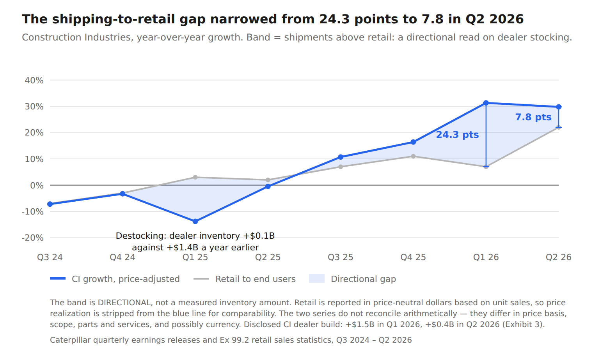

# Caterpillar Demand Quality

## 1. Project question
Was Caterpillar's 2026 Construction Industries growth driven by real end-user demand or dealer restocking?

## 2. One-sentence finding
Caterpillar's Construction Industries growth was still heavily supported by dealer restocking in Q1 2026, but by Q2 the mix had shifted materially toward end-user demand.

## 3. Key evidence

- **8** quarters analyzed, Q3 2024 – Q2 2026
- **32 / 32** segment bridges reconcile to zero
- **0** assumed figures
- **16** comparability issues logged and tested

A bridge is Caterpillar's own disclosed volume, price realization, currency, and inter-segment components reconciled against its reported sales change, tested for each of four segments across eight quarters. Reconciliation demonstrates internal consistency with those components, not that the right line items were chosen.

| Construction Industries | Q1 2026 | Q2 2026 |
|---|---:|---:|
| Disclosed CI dealer-inventory build | $1.5B | $400M |
| Management driver named first | dealer inventories | end users |
| Adjusted reported-vs-retail gap | 24.3 pts | 7.8 pts |
| Retail sales growth to end users | 7% | 22% |
| Reported CI sales growth | 38.1% | 34.8% |

Reported growth barely moved. What produced it changed.

> Read the reported-vs-retail gap as a **directional** indicator of dealer stocking, not as an exact dollar measurement of inventory. The two disclosures differ in price basis, scope, the treatment of parts and services, and possibly currency.

## 4. Hero exhibit

*Construction Industries, year-over-year growth. Band = shipments above retail: a directional read on dealer stocking.*

The band is DIRECTIONAL, not a measured inventory amount. Retail is reported in price-neutral dollars based on unit sales, so price realization is stripped from the blue line for comparability. The two series do not reconcile arithmetically — they differ in price basis, scope, parts and services, and possibly currency. Disclosed CI dealer build: +$1.5B in Q1 2026, +$0.4B in Q2 2026.

*Source: Caterpillar quarterly earnings releases and Ex 99.2 retail sales statistics, Q3 2024 – Q2 2026.*

## 5. What the project demonstrates
- Segment-level reconciliation discipline: every volume/price/currency/inter-segment bridge closes to zero across all 32 quarter-segment checks.
- A four-level sourcing classification (SOURCED / DERIVED / CALC / NOT DISCLOSED, with INFERRED used only in notes) applied to every figure, with no assumed inputs anywhere in the dataset.
- A logged comparability record: segment renames, a prior-year restatement, and a retail-basis wording change are surfaced and tested rather than smoothed over or hidden.
- A forward view stated as a falsifiable inference, with explicit conditions that would strengthen, weaken, or redirect the thesis — including an alternative hypothesis (demand pull-forward) and one expected corroboration (cash flow) that didn't hold up.
- Correct handling of a cost-shock distortion: ex-tariff margin is explicitly framed as an upper bound, not claimed as an efficiency or cost-control result.

## 6. Forward judgment: what this implies, and what would break it

*Stated as inference, not finding. All three describe H2 2026, which had not been reported when this was written.*

If Caterpillar follows through on the expected dealer-inventory drawdown while end-user demand remains healthy, dealer stocking should contribute less to reported CI growth in H2 2026. Reported growth should therefore move closer to retail growth, or temporarily trail it during destocking.

- **Strengthens the thesis** — Retail growth remains elevated while dealer inventory growth continues to slow or turns negative.
- **Weakens the thesis** — Retail growth falls materially in H2 while dealer inventories draw down, suggesting Q2's 22% was a temporary spike rather than evidence of durable end demand.
- **Alternative: demand pull-forward** — Positive tariff-related price realization may have encouraged some customers to purchase earlier than planned, inflating Q2 retail at the expense of H2. A hypothesis, not a proven fact. H2 retail behavior should distinguish durable demand from pull-forward.

**What I expected to corroborate — and didn't:** inventory-heavy Q1 2026 growth was expected to show up as unusually weak cash conversion. It didn't — Q1 is seasonally weak and Q1 2026 operating cash flow was stronger than Q1 2025, so cash flow does not independently confirm the stocking thesis. It is reported here because leaving it out would be selective.

## 7. Methodology and auditability

Financial figures are sourced to Caterpillar and SEC filings wherever available: quarterly earnings releases Q3 2024 – Q2 2026, Ex 99.2 Rolling 3-Month Retail Sales Statistics, and the Q1 and Q2 2026 Forms 10-Q (accessions 0000018230-26-000021 and -000046). Management commentary not reproduced in a filing is identified as earnings-call commentary and supported by transcript sources. No third-party estimates or analyst summaries are used as financial inputs. Where the 10-Q documents would not serve Item 2 on retrieval, figures were confirmed by exact-phrase match against the EDGAR full-text index — present in the filing, though the surrounding sentence was not read.

Every figure in the workbook is classified SOURCED, DERIVED, CALC or NOT DISCLOSED, with INFERRED used in notes where a filing's scope or period qualifier could not be recovered. ASSUMPTION is part of the project's classification scheme but appears nowhere in this dataset — no figure here is assumed.

Full detail: [`docs/methodology.md`](docs/methodology.md) · [`docs/sources.md`](docs/sources.md) · [`docs/definitions.md`](docs/definitions.md)

## 8. Limitations
- The reported-vs-retail gap is directional and relative, not a precise dealer-inventory dollar measure.
- Q2 2026 retail strength is a single observation and needs H2 confirmation.
- Segment-level dealer-inventory dollars are not disclosed continuously, so no unbroken eight-quarter series exists at either scope.
- Ex-tariff margin is an upper bound on underlying performance, not a clean efficiency measure: the price realization that lifted it was taken partly to recover the same tariff costs.

## 9. Downloads / files

| File | Description |
|---|---|
| [`analysis/Caterpillar_Demand_Quality_Case_Study.pdf`](analysis/Caterpillar_Demand_Quality_Case_Study.pdf) | Full written case study |
| [`model/CAT_8Q_Operating_Dataset.xlsx`](model/CAT_8Q_Operating_Dataset.xlsx) | Eight-quarter dataset, 32 reconciled bridges, source and classification for every figure, comparability log |
| [`docs/methodology.md`](docs/methodology.md) | Sourcing rules, classification scheme, verification method |
| [`docs/sources.md`](docs/sources.md) | Every source document, with direct links |
| [`docs/definitions.md`](docs/definitions.md) | Classification scheme and tab-by-tab dataset definitions |
| [`assets/`](assets/) | Exhibit charts, light theme (PNG and SVG where available) |
| [`assets/dark/`](assets/dark/) | Exhibit charts, dark theme where available (Exhibits 1–4 and 6) |
